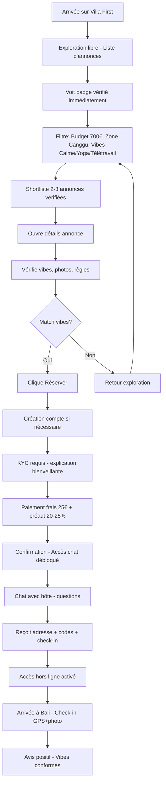
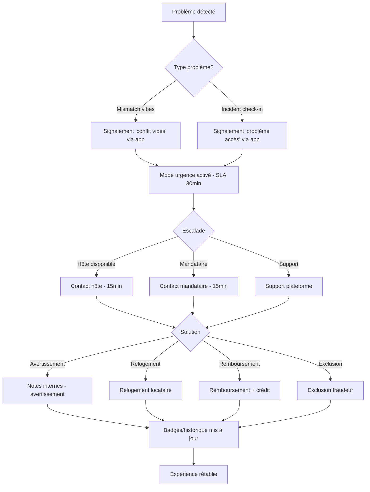
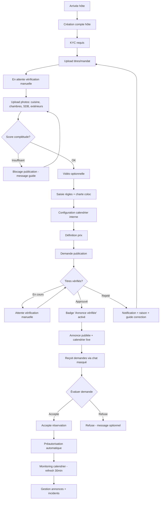

# UX Design Specification Villa first v2

**Author:** Falsone
**Date:** 2026-01-20T07:08:42.064Z

---

<!-- UX design content will be appended sequentially through collaborative workflow steps -->

## Executive Summary

### Project Vision

Villa First est une marketplace de mise en relation pour colocations à Bali, conçue pour transformer l'expérience chaotique des groupes Facebook/WhatsApp en un parcours sécurisé, structuré et fiable. La vision centrale repose sur la vérification et la confiance : chaque annonce vérifiée bénéficie d'un badge de confiance obtenu après vérification manuelle des titres de propriété/mandats et KYC hôte. Cette différenciation clé positionne Villa First comme une solution professionnelle, pas juste un groupe social.

Le modèle économique MVP se base sur des frais fixes de réservation (25 €) qui servent à réserver la place, débloquer le chat, et confirmer le sérieux du locataire. L'objectif est de sécuriser, filtrer et structurer la recherche de colocations pour digital nomads et voyageurs longue durée, tout en offrant aux hôtes un outil pro pour gagner du temps et accéder à des locataires préqualifiés et alignés avec l'esprit du lieu.

### Target Users

**Locataires (Digital Nomads & Voyageurs Longue Durée)**
- **Profil** : Chercheurs de colocations vérifiées avec matching vibes (télétravail, yoga, calme, festif, sportif)
- **Frustrations actuelles** : Annonces non vérifiées, manque de transparence sur les règles, difficulté à trouver des colocs qui matchent leurs vibes, trop de bruit sur les groupes sociaux, aucun cadre de confiance
- **Contexte d'utilisation** : Majoritairement en déplacement ou recherche depuis leur pays d'origine, souvent sur mobile, recherche rapide parfois sous pression (arrivée imminente)
- **Besoin principal** : Trouver rapidement une coloc sécurisée qui correspond à leurs vibes, avec transparence totale et filet de sécurité

**Hôtes/Mandataires (Propriétaires & Gestionnaires)**
- **Profil** : Propriétaires ou mandataires voulant sortir du chaos Facebook/WhatsApp, prêts à passer vérification pour badge vérifié
- **Motivations** : Gain de temps (moins de messages inutiles, profils préqualifiés), accès à locataires sérieux et alignés, badge "annonce vérifiée" comme preuve de sérieux, réduction conflits grâce au matching vibes, centralisation (réservation, paiement, chat, règles)
- **Contexte d'utilisation** : Utilisation mixte mobile + desktop, desktop pour gérer annonces, mobile pour répondre/chatter/valider réservations
- **Besoin principal** : Outil professionnel pour gérer efficacement leurs annonces avec locataires de confiance

**Support Plateforme**
- **Profil** : Équipe gérant vérification manuelle, incidents, fraude
- **Rôle** : Maintenir la qualité et la confiance de la plateforme via vérification rigoureuse et support réactif

### Key Design Challenges

**1. Friction vs Valeur Perçue (KYC)**
- Équilibrer exploration libre sans KYC avec vérification au bon moment (réservation/publication/chat)
- Expliquer clairement le "pourquoi" de la vérification : "La vérification protège la communauté"
- Associer le badge à des avantages concrets (priorité, confiance, accès) pour transformer la friction en valeur

**2. Matching Vibes Intuitif**
- Rendre le matching simple et déclaratif sans questionnaire long ou intrusif
- Quelques critères clés (rythme de vie, travail, sociabilité) suffisants pour filtrer efficacement
- Interface qui guide sans surcharger, permettant aux utilisateurs de déclarer leurs préférences naturellement

**3. Différenciation Vérifié vs Non Vérifié**
- Communication visuelle claire et immédiate (badge, couleur, icône)
- Explication simple : "Annonce vérifiée = identité confirmée, logement contrôlé, règles claires"
- Ton rassurant, jamais anxiogène, pas de jugement mais des niveaux de confiance

**4. Chat Masqué Fluide**
- Chat débloqué uniquement après réservation
- Identité partiellement masquée avant validation pour éviter contournement
- Expérience de communication naturelle malgré les contraintes de sécurité
- Mode hors ligne intelligent pour charger derniers messages et rester simple/lisible

**5. Parcours de Paiement Optimisé**
- Frais fixes simples (25 €) pour réserver, débloquer chat, confirmer sérieux
- Parcours rapide et rassurant pour limiter abandon
- Communication claire de la valeur : ce que le paiement débloque et protège

### Design Opportunities

**1. Badge de Confiance comme Différenciateur Visuel**
- Design du badge "vérifié" immédiatement reconnaissable et rassurant
- Hiérarchie visuelle claire : annonces vérifiées prioritaires, non vérifiées secondaires
- Carte de confiance combinant badge vérif + dernière sync + complétude pour transparence totale

**2. Exploration Progressive sans Friction**
- Permettre découverte complète sans KYC initial
- Introduction progressive de la vérification au moment de l'engagement (réservation/publication)
- Parcours qui guide naturellement vers la vérification en montrant sa valeur

**3. Matching Vibes comme Avantage Concurrentiel**
- Interface simple et déclarative pour exprimer ses préférences
- Visualisation claire des colocations qui matchent
- Avertissement intelligent en cas de mismatch fort sans bloquer l'offre

**4. Expérience Mobile-First Optimisée**
- Design mobile-first pour locataires en déplacement
- Desktop optimisé pour gestion hôte (création/modification annonces)
- Responsive design cohérent entre plateformes avec synchronisation temps réel

**5. Mode Hors Ligne Intelligent**
- Accès aux informations critiques (adresse, codes, contacts urgence) même sans connexion stable
- Chat avec chargement des derniers messages en mode dégradé
- Expérience qui reste fonctionnelle lors de moments critiques (arrivée à Bali sans connexion)

## Core User Experience

### Defining Experience

L'expérience centrale de Villa First, côté locataires, est **d'explorer et filtrer des annonces** (vibes / budget / localisation) de manière **mobile-first**, avec un objectif simple : *comprendre en 2 secondes si une coloc me correspond*.

Villa First doit surpasser Facebook/WhatsApp sur 3 points immédiats :
- **Lisibilité** : annonces claires, structurées, comparables
- **Confiance** : "vérifié" visible tout de suite, sans ambiguïté
- **Matching rapide** : vibes compréhensibles instantanément (2–4 vibes clés directement sur la carte annonce)

L'exploration doit rester **libre** (pas de compte imposé trop tôt). L'engagement commence au moment où l'utilisateur choisit de **réserver**.

### Platform Strategy

- **Mobile-first (référence)** pour la recherche/exploration : usage quasi exclusivement mobile, souvent en déplacement ou depuis l'étranger.
- **Desktop secondaire** pour cette étape (propre, mais non prioritaire).
- **Desktop-oriented côté hôtes** (gestion d'annonces), **mobile côté hôtes** pour répondre / chatter / valider.

L'interface de listing doit afficher :
- **Badge "vérifié" immédiatement visible** (sans scroll)
- **2–4 vibes clés** affichées **directement sur la carte annonce** (icônes/tags lisibles)
- Un accès à des **filtres avancés** via un panneau secondaire, sans nuire au "cœur" : la compréhension instantanée.

### Effortless Interactions

Ce qui doit être "sans effort" (zéro charge mentale) :

**Dans la liste d'annonces**
- Voir le **badge vérifié** immédiatement
- Lire les **vibes** dès la carte annonce (sans ouvrir de panneau)
- Comparer plusieurs annonces "mentalement" en scrollant (standardisation visuelle)
- Modifier les filtres **sans perdre le contexte** (recherche conservée, feedback immédiat)

**Exploration → Réservation**
- Transition simple, directe
- Pas de création de compte trop tôt
- La réservation marque le début de l'engagement (et déclenche les garde-fous : KYC/paiement/chat)

**Matching vibes**
- Déclaratif, rapide, léger
- Jamais la sensation de "remplir un formulaire"

**Valeur du vérifié**
- Badge + micro-texte explicatif simple
- Comparaison implicite avec non vérifié
- Ton rassurant, jamais anxiogène

### Critical Success Moments

**Moment "c'est mieux que Facebook/WhatsApp"**
- Il arrive **dès la liste d'annonces**, quand l'utilisateur voit :
  - des annonces claires et structurées
  - un badge vérifié visible
  - des vibes immédiatement compréhensibles
  - un cadre "sérieux et organisé"

**Moment où la confiance s'installe**
- En 2 temps :
  1) **Très tôt** : badge visible + différenciation vérifié / non vérifié claire
  2) **À la réservation** : explication simple du cadre (paiement, chat débloqué, règles) → sensation de plateforme sécurisée

### Experience Principles

- **Exploration libre, vérification progressive**
- **Confiance visible immédiatement**
- **Matching simple et déclaratif**
- **Transparence totale (vérifié / non vérifié)**
- **Clarté avant exhaustivité** (peu d'info, mais ultra lisible)
- **Anti-chaos** (structure et cadre là où Facebook est brouillon)
- **No stress UX** (pas de pression, pas de dark patterns)
- **Mobile-first locataires, desktop-oriented hôtes** (pensé pour des utilisateurs en déplacement)

## Desired Emotional Response

### Primary Emotional Goals

L'objectif émotionnel principal de Villa First est de faire sentir les utilisateurs **rassurés et en sécurité**, avec un sentiment secondaire d'**être en contrôle** de leurs choix. Contrairement à l'anarchie des groupes Facebook/WhatsApp où règnent le doute et la méfiance, Villa First doit créer un espace où la confiance est visible, la structure est évidente, et où l'utilisateur se sent **protégé** tout en gardant son **autonomie**.

Cette combinaison de **sécurité + contrôle** permet aux locataires de faire des choix éclairés sans stress, et aux hôtes de gérer efficacement leurs annonces avec sérénité.

### Emotional Journey Mapping

**Découverte (liste d'annonces)**
- **Émotion cible :** Rassuré, confiant
- **Sentiment :** "Je comprends immédiatement ce que je regarde, je peux faire confiance"
- **Moment clé :** Badge vérifié visible + vibes lisibles → confiance immédiate

**Pendant le filtrage**
- **Émotion cible :** En contrôle, serein
- **Sentiment :** "Je peux affiner ma recherche sans perdre le fil, je maîtrise ma recherche"
- **Moment clé :** Filtres qui répondent instantanément, contexte conservé

**Après avoir shortlisté 2–3 annonces**
- **Émotion cible :** Confiant, projeté
- **Sentiment :** "J'ai trouvé des options sérieuses, je peux me projeter, je suis proche de mon objectif"
- **Moment clé :** Comparaison facile entre annonces, toutes vérifiées et structurées

**Au moment de réserver/payer**
- **Émotion cible :** Sécurisé, rassuré
- **Sentiment :** "Je passe une étape importante, mais je suis en sécurité, le cadre est clair"
- **Moment clé :** Explication simple du processus (paiement, chat débloqué, règles), pas de surprise

**Si quelque chose coince (KYC, paiement, indispo)**
- **Émotion cible :** Guidé, pris en charge
- **Sentiment :** "Il y a un hic, mais on m'aide, je ne suis pas seul, c'est gérable"
- **Moment clé :** Messages clairs, solutions proposées, support accessible

### Micro-Emotions

Les 3 micro-émotions critiques pour le succès de Villa First :

**1. Confiance vs Scepticisme**
- **Objectif :** Transformer le scepticisme naturel (venu de l'expérience Facebook/WhatsApp) en confiance immédiate
- **Moment critique :** Dès la découverte de la liste, quand l'utilisateur voit les badges vérifiés et la structure claire
- **Design implication :** Badge vérifié visible + explication simple + comparaison implicite avec non vérifié

**2. Clarté vs Confusion**
- **Objectif :** Éliminer toute confusion sur ce qu'est une annonce, ce qu'elle offre, comment réserver
- **Moment critique :** Lors du filtrage et de la comparaison des annonces
- **Design implication :** Standardisation visuelle, labels clairs, informations hiérarchisées, pas de jargon

**3. Calme vs Anxiété**
- **Objectif :** Remplacer l'anxiété du "vais-je me faire arnaquer ?" par un calme serein
- **Moment critique :** Au moment de réserver/payer (décision financière)
- **Design implication :** Processus transparent, pas de dark patterns, explications rassurantes, filet de sécurité visible

### Design Implications

**Pour créer la confiance :**
- Badge vérifié **toujours visible** et immédiatement compréhensible
- Micro-texte explicatif simple ("Annonce vérifiée = identité confirmée, logement contrôlé")
- Comparaison visuelle implicite avec annonces non vérifiées (hiérarchie claire)
- Transparence totale sur le processus de vérification

**Pour créer la clarté :**
- Standardisation visuelle des cartes annonces (même structure, même emplacement des infos)
- Labels explicites et sans jargon technique
- Hiérarchie d'information évidente (vérifié → vibes → prix → localisation)
- Feedback immédiat sur toutes les actions (filtres, réservation, paiement)

**Pour créer le calme :**
- Pas de pression temporelle artificielle ("plus que 2 places !")
- Pas de dark patterns (pas de forcer à payer, pas de cases pré-cochées cachées)
- Processus de réservation/paiement **linéaire et prévisible**
- Messages rassurants à chaque étape ("Vous êtes protégé", "Votre réservation est sécurisée")

**Pour éviter les émotions négatives :**
- **Peur de se faire arnaquer** → Badge vérifié + explications + historique vérifications
- **Stress/anxiété** → Pas de compte trop tôt, pas de pression, processus clair
- **Confusion ou impression d'être forcé à payer** → Exploration libre, explication de la valeur du paiement, possibilité de sortir facilement

**Pour créer les moments de guidance :**
- Messages d'erreur clairs et actionnables (pas de "Erreur 404")
- Solutions proposées quand quelque chose bloque (KYC, paiement)
- Support accessible et visible en cas de problème

### Emotional Design Principles

- **Sécurité avant tout** : Chaque décision de design doit renforcer la sensation de sécurité, jamais la diminuer
- **Clarté immédiate** : L'utilisateur doit comprendre en 2 secondes où il est et ce qu'il peut faire
- **Calme par design** : Pas de pression, pas de stress artificiel, pas de dark patterns
- **Confiance visible** : Les éléments de confiance (badge, vérifications) doivent être visibles sans effort
- **Guidance bienveillante** : Quand l'utilisateur est bloqué, on le guide, on ne le laisse pas seul
- **Respect de l'autonomie** : L'utilisateur garde le contrôle, on ne force jamais une décision
- **Anti-chaos émotionnel** : Structure et ordre pour apaiser l'esprit, contrairement au brouillard Facebook/WhatsApp

## UX Pattern Analysis & Inspiration

### Inspiring Products Analysis

**1. Airbnb**
- **Problème résolu :** Trouver un logement fiable rapidement dans un contexte de méfiance naturelle
- **Onboarding :** Progressif, non bloquant, permet exploration avant création de compte
- **Navigation :** Hiérarchie claire (prix, lieu, confiance), liste + carte synchronisées
- **Interactions clés :** Badges de confiance, cartes visuelles riches, filtres dynamiques qui se mettent à jour instantanément
- **Choix visuels :** Photos dominantes, informations essentielles priorisées (prix, localisation, badge vérifié), standardisation visuelle des cartes
- **Gestion erreurs :** Messages rassurants, solutions proposées plutôt que simples erreurs techniques
- **Ce qui rend l'expérience agréable :** On comprend vite si un logement est fiable, sensation de contrôle et de projection
- **Pourquoi ils y reviennent :** Standard de confiance élevé, réduction du risque perçu

**2. Bumble (Matching d'affinités)**
- **Problème résolu :** Éviter les incompatibilités fortes en facilitant le matching déclaratif
- **Onboarding :** Déclaratif, rapide, peu de questions, décisions rapides
- **Navigation :** Ultra simple, peu de choix à la fois, focus sur l'action principale
- **Interactions clés :** Matching visuel immédiat, feedback clair ("ça match / ça ne match pas" en quelques secondes)
- **Choix visuels :** Interface claire, humaine, émotionnelle, sans surcharge cognitive
- **Gestion erreurs :** Jamais culpabilisantes, ton bienveillant
- **Ce qui rend l'expérience engageante :** Sensation de compatibilité immédiate, feedback clair
- **Pourquoi ils y reviennent :** Clarté du matching, sentiment d'appartenance / affinité

**3. Couchsurfing (Confiance sociale)**
- **Problème résolu :** Faire confiance à des inconnus dans un contexte de partage collaboratif
- **Onboarding :** Basé sur la réputation progressive, pas de vérification bloquante initiale
- **Navigation :** Profils riches mais lisibles, niveaux de confiance visibles en un coup d'œil
- **Interactions clés :** Références visibles, niveaux de confiance multi-critères, accès progressif aux infos sensibles
- **Choix visuels :** Sobriété, lisibilité, transparence sur les niveaux de confiance
- **Gestion erreurs :** Pédagogie + protection utilisateur, pas de jugement
- **Ce qui rend l'expérience rassurante :** Transparence sur le niveau de confiance, historique et réputation visibles
- **Pourquoi ils y reviennent :** Sentiment de communauté, sécurité sociale perçue

### Transferable UX Patterns

**Patterns de Navigation :**
- **Liste + carte synchronisées** (Airbnb) → Pour permettre exploration géographique et liste comparative simultanément
- **Filtres visibles dès l'exploration** (Airbnb) → Vibes, budget, zone accessibles sans ouvrir un panneau complexe
- **Comparaison rapide de 2–3 annonces shortlistées** → Facilite le choix final en permettant comparaison côte-à-côte mentalement ou visuellement

**Patterns d'Interaction :**
- **Badge de confiance multi-niveaux** (Airbnb + Couchsurfing) → ID vérifiée, titre vérifié, mandat vérifié, calendrier synchronisé, chaque niveau visible et explicite
- **Matching vibes déclaratif** (Bumble) → Pas de questionnaire long, quelques critères clés (calme, festif, spiritualité, télétravail), feedback immédiat
- **Accès progressif au chat et coordonnées** (Couchsurfing) → Après réservation uniquement, évite contournement plateforme, protection mutuelle

**Patterns Visuels :**
- **Badge vérifié immédiatement visible sur les cartes** (Airbnb) → Sans scroll, en haut à droite ou intégré dans le titre, couleur distinctive
- **Icônes simples pour vibes** (inspiration Bumble) → Calme (🌙), Social (🎉), Spiritualité (🧘), Télétravail (💻), visualisation immédiate
- **Hiérarchie claire : confiance > vibes > prix** → L'œil va naturellement vers le badge, puis les vibes, puis le prix, même ordre dans toutes les cartes

### Anti-Patterns to Avoid

**À éviter absolument :**
- **Vérification KYC bloquante trop tôt** → Tuer l'exploration libre, créer friction avant valeur perçue
- **Questionnaires longs et intrusifs** → Casser le flow, créer sensation de "formulaire administratif"
- **Badges peu lisibles ou ambigus** → Nuire à la confiance, créer confusion au lieu de rassurance
- **Messages anxiogènes** ("attention", "risque", "erreur" sans contexte) → Créer stress et anxiété, contraire à l'objectif de calme
- **Obligation de paiement sans compréhension claire de la valeur** → Impression d'être forcé, créer méfiance
- **Informations clés cachées derrière trop de clics** → Perdre la compréhension immédiate ("2 secondes pour comprendre")

### Design Inspiration Strategy

**Ce qu'on adopte directement :**
- **Badges de confiance multi-niveaux visibles immédiatement** (Airbnb + Couchsurfing) → Aligné avec objectif de sécurité et confiance visible
- **Standardisation visuelle des cartes annonces** (Airbnb) → Facilite comparaison mentale, crée clarté
- **Matching déclaratif simple** (Bumble) → Aligné avec principe "matching simple et déclaratif", évite friction

**Ce qu'on adapte pour Villa First :**
- **Liste + carte synchronisées** → Simplifier pour mobile-first, peut-être toggle plutôt que vue simultanée sur petit écran
- **Accès progressif au chat** (Couchsurfing) → Adapter : chat masqué jusqu'après réservation + paiement (contrainte métier spécifique)
- **Badges multi-niveaux** → Simplifier affichage public (résumé "Annonce vérifiée") avec détail au clic pour éviter surcharge

**Ce qu'on évite :**
- **Onboarding trop lourd** (même si Airbnb a évolué vers plus de friction) → Garder exploration libre, onboarding minimal
- **Pression temporelle artificielle** → Pas de "plus que 2 places !", contraire à "no stress UX"
- **Surcharge visuelle des profils** (Couchsurfing peut être dense) → Garder focus sur l'essentiel, clarté avant exhaustivité

**Conclusion :** Villa First doit combiner la confiance d'Airbnb, la simplicité de matching de Bumble, et la preuve sociale de Couchsurfing, tout en évitant la surcharge, la pression et la confusion. L'inspiration guide notre design, mais nous adaptons chaque pattern aux besoins spécifiques de notre contexte (mobile-first, vérification progressive, frais fixes simples).

## Design System Foundation

### Design System Choice

**Tailwind CSS + Headless UI (Radix UI)**

Pour Villa First MVP, nous choisissons **Tailwind CSS** comme système de styling utilitaires combiné avec **Headless UI / Radix UI** pour les composants interactifs complexes (modals, dropdowns, formulaires). Cette combinaison offre le meilleur équilibre entre rapidité de développement, personnalisation totale, et performance mobile.

### Rationale for Selection

**1. Différenciation visuelle maximale**
- Personnalisation complète nécessaire pour le badge vérifié (design unique, visible immédiatement)
- Système de vibes visuels (icônes/tags) qui doit être distinctif et immédiatement reconnaissable
- Pas de contraintes d'un thème pré-établi qui limiterait l'identité visuelle

**2. Performance mobile-first (PWA)**
- Tailwind CSS génère du CSS optimisé et minimal (tree-shaking automatique)
- Bundle size réduit par rapport aux bibliothèques complètes (MUI, Chakra)
- Critique pour PWA mobile où chaque KB compte

**3. Rapidité de développement MVP**
- Une fois la configuration initiale faite (tokens, composants de base), développement très rapide
- Classes utilitaires permettent de prototyper rapidement sans créer de composants custom pour chaque variante
- Écosystème riche : shadcn/ui peut fournir des composants de base pré-stylés avec Tailwind

**4. Flexibilité et évolutivité**
- Aucune contrainte de thème qui imposerait des décisions de design
- Facilite l'évolution du design system au fur et à mesure de l'apprentissage utilisateur
- Facile à maintenir : styles collocalisés avec les composants, pas de CSS global complexe

**5. Accessibilité intégrée**
- Headless UI / Radix UI fournissent les primitives interactives accessibles (ARIA, gestion clavier, focus management)
- Nous gardons le contrôle visuel tout en bénéficiant des meilleures pratiques d'accessibilité

**6. Alignement avec stack technique probable**
- Compatible avec React/Next.js (mentionné dans PRD comme option technique)
- Écosystème mature et documenté
- Communauté large pour support et ressources

### Implementation Approach

**Phase 1 : Configuration initiale (MVP)**
1. **Design Tokens** : Définir couleurs, typographie, espacements, ombres dans `tailwind.config.js`
   - Palette de couleurs pour confiance (vert pour vérifié, gris pour non vérifié)
   - Système de spacing cohérent pour mobile-first
   - Typographie optimisée pour lisibilité mobile

2. **Composants de base** : Créer composants réutilisables essentiels
   - Badge vérifié (design unique, visible immédiatement)
   - Cards d'annonces (standardisées pour comparaison facile)
   - Filtres (vibes, budget, localisation)
   - Boutons et inputs (cohérents avec principes émotionnels : calme, clarté)

3. **Primitives Headless UI** : Intégrer composants interactifs
   - Modals (réservation, KYC)
   - Dropdowns (filtres avancés)
   - Formulaires (matching vibes, paiement)

**Phase 2 : Optimisation (Post-MVP)**
- Affiner composants basés sur feedback utilisateur
- Créer système de variants plus sophistiqué si besoin
- Optimiser bundle size avec PurgeCSS configuration

### Customization Strategy

**Éléments personnalisés prioritaires :**

**1. Badge vérifié (différenciateur clé)**
- Design complètement custom avec Tailwind
- Animation subtile pour attirer l'œil sans être intrusif
- Variants : vérifié complet, partiellement vérifié, non vérifié
- Micro-texte explicatif intégré au design

**2. Système de vibes (avantage concurrentiel)**
- Icônes/tags visuels custom pour calme, festif, spiritualité, télétravail
- Couleurs distinctives mais harmonieuses
- Affichage inline sur cartes annonces sans surcharge

**3. Cartes annonces (core experience)**
- Layout mobile-first optimisé avec Tailwind Grid/Flexbox
- Hiérarchie visuelle claire : badge → vibes → prix → localisation
- Standardisation pour comparaison mentale facile

**4. Système de couleurs pour émotions**
- Palette "confiance" (verts rassurants, pas trop vifs)
- Palette "calme" (tons neutres, pas d'agressivité)
- Contraste suffisant pour accessibilité (WCAG AA)

**5. Typographie mobile-first**
- Tailles optimisées pour lecture mobile
- Hiérarchie claire mais pas écrasante
- Espacement généreux pour réduire charge cognitive

**Principes de customisation :**
- Chaque élément custom doit servir un objectif UX précis (confiance, clarté, calme)
- Éviter la sur-personnalisation qui crée de la confusion
- Tester sur mobile en premier, desktop secondaire
- Documenter les décisions de design dans le design system pour cohérence future

## 2. Core User Experience

### 2.1 Defining Experience

L'expérience centrale qui définit Villa First est **"Explorer et filtrer des annonces vérifiées avec matching vibes"** avec l'objectif de comprendre en 2 secondes si une coloc correspond vraiment.

Cette expérience centrale est la version transformée du chaos Facebook/WhatsApp en quelque chose de **structuré, fiable et immédiatement compréhensible**. Si on réussit cette interaction, tout le reste suit naturellement : la confiance s'installe, la réservation devient évidente, et l'utilisateur se sent en sécurité.

**La phrase qu'un utilisateur dirait à un ami :**
*"En 2 secondes, je vois si une coloc est vérifiée et si elle match mes vibes. Plus besoin de scroll dans le chaos Facebook."*

**Ce qui rend cette expérience réussie :**
- Badge vérifié visible immédiatement (sans scroll) → confiance instantanée
- Vibes compréhensibles dès la carte annonce (2-4 icônes/tags) → matching rapide
- Filtres qui répondent instantanément sans perdre le contexte → contrôle total
- Standardisation visuelle des cartes → comparaison mentale facile

Cette expérience centrale diffère de la concurrence par sa **clarté immédiate** (vs bruit Facebook) et sa **confiance visible** (vs opacité des autres marketplaces).

### 2.2 User Mental Model

**Comment les utilisateurs résolvent actuellement ce problème :**
Les locataires passent des heures sur Facebook/WhatsApp à :
- Scroller dans des centaines de messages non structurés
- Essayer de deviner si une annonce est fiable (pas de vérification)
- Filtrer mentalement les posts qui ne matchent pas (pas de tags vibes)
- Comparer plusieurs options dans leur tête (pas de standardisation)

**Modèle mental qu'ils apportent :**
- Ils s'attendent à voir une **liste d'annonces** (pattern familier Airbnb/Booking)
- Ils comprennent intuitivement les **badges de confiance** (pattern Airbnb)
- Ils sont habitués aux **filtres** mais frustrés quand ils sont cachés ou complexes
- Ils recherchent une **expérience mobile-first** (usage principal sur smartphone)

**Attentes spécifiques :**
- Arriver avec des critères (budget, zone, vibes) mais vouloir aussi explorer pour découvrir
- Comprendre immédiatement la différence vérifié/non vérifié sans explication longue
- Comprendre les vibes visuellement (icônes = calme, social, spiritualité, télétravail) sans tooltip obligatoire (mais tooltip optionnel pour clarification)

**Où ils risquent de se perdre :**
- Si le badge vérifié n'est pas assez visible ou explicite
- Si les vibes nécessitent trop d'interprétation (icônes ambiguës)
- Si les filtres cassent le flow (panneau complexe, perte de contexte)
- Si la comparaison entre annonces est difficile (layouts différents)

### 2.3 Success Criteria

**Critères de succès pour l'expérience centrale :**

**1. Compréhension immédiate (2 secondes)**
- L'utilisateur comprend en 2 secondes si une annonce est vérifiée (badge visible)
- Il comprend immédiatement si les vibes matchent (icônes lisibles)
- Il sait où il est et ce qu'il peut faire (navigation claire)

**2. Sensation de contrôle**
- Les filtres répondent instantanément (pas de délai perceptible)
- La recherche est conservée quand il modifie les filtres (pas de reset)
- Il peut facilement comparer 2-3 annonces mentalement (standardisation visuelle)

**3. Confiance visible**
- Badge vérifié apparaît sur toutes les annonces vérifiées de manière cohérente
- Différence visuelle claire entre vérifié/non vérifié (hiérarchie)
- Pas de doute sur ce que signifie "vérifié" (micro-texte explicatif si besoin)

**4. Matching efficace**
- Après filtrage, il voit des annonces pertinentes (≥80% de pertinence selon PRD)
- Les vibes sont réellement représentatifs de la coloc (pas de mismatch frustrant)
- Il peut shortlister 2-3 annonces rapidement sans effort

**5. Flow sans friction**
- Exploration libre sans création de compte imposée trop tôt
- Pas de popup intrusifs qui cassent le flow
- Feedback immédiat sur toutes les actions (clic, filtre, scroll)

**Indicateurs de succès mesurables :**
- Temps moyen pour comprendre qu'une annonce est vérifiée : <2 secondes
- Taux de clic sur annonces vérifiées vs non vérifiées : vérifiées préférées
- Nombre moyen d'annonces shortlistées avant réservation : 2-3
- Taux d'abandon pendant l'exploration : minimal (exploration libre = pas de pression)

### 2.4 Novel UX Patterns

**Analyse : Patterns établis avec innovations spécifiques**

L'expérience centrale de Villa First **combine des patterns établis** (liste d'annonces, badges, filtres) avec des **innovations dans la combinaison** et l'**optimisation mobile-first**.

**Patterns établis utilisés :**
- **Liste d'annonces avec cartes** (Airbnb, Booking) → Pattern familier, rassurant
- **Badges de confiance** (Airbnb, Couchsurfing) → Compris intuitivement
- **Filtres dynamiques** (tous les marketplaces) → Attendu par les utilisateurs
- **Tags/icônes pour catégorisation** (Bumble, Airbnb) → Reconnu visuellement

**Innovations spécifiques à Villa First :**

**1. Badge vérifié multi-niveaux simplifié pour affichage public**
- **Nouveau :** Résumé "Annonce vérifiée" visible immédiatement, détail (ID + titre + mandat + calendrier) au clic
- **Pourquoi innovant :** Évite surcharge visuelle tout en gardant transparence
- **Éducation utilisateur :** Tooltip optionnel au survol "Vérifié = identité + logement + règles confirmés"

**2. Vibes visuels intégrés directement sur les cartes annonces**
- **Nouveau :** 2-4 icônes vibes directement visibles sur chaque carte (pas dans un panneau séparé)
- **Pourquoi innovant :** Matching visuel immédiat sans ouvrir l'annonce, comparaison rapide
- **Éducation utilisateur :** Icônes intuitives (🌙 calme, 🎉 social, 🧘 spiritualité, 💻 télétravail) + légende discrète si besoin

**3. Hiérarchie visuelle : confiance > vibes > prix**
- **Nouveau :** Ordre d'affichage des infos optimisé pour la prise de décision (confiance d'abord, puis compatibilité, puis budget)
- **Pourquoi innovant :** Priorise ce qui compte vraiment (sécurité puis matching) avant le prix
- **Éducation utilisateur :** Naturel grâce à taille/position des éléments (badge en haut, vibes juste en dessous)

**4. Exploration 100% libre avec engagement progressif**
- **Nouveau :** Pas de compte obligatoire pour explorer, filtres accessibles sans login, KYC seulement à la réservation
- **Pourquoi innovant :** Contrairement aux marketplaces qui demandent compte tôt, on maximise la découverte libre
- **Éducation utilisateur :** Messages clairs "Explorez librement, créez un compte seulement pour réserver"

**Ce qui ne nécessite PAS d'éducation utilisateur :**
- Les patterns de base (liste, badges, filtres) sont déjà connus
- Les icônes vibes sont intuitives si bien choisies
- Le flow général (explorer → filtrer → comparer → réserver) est standard

**Ce qui nécessite une légère éducation :**
- Badge vérifié multi-niveaux : tooltip optionnel "Cliquez pour voir les détails de vérification"
- Vibes : légende discrète accessible si besoin (mais pas imposée)
- Différence vérifié/non vérifié : micro-texte explicatif simple au premier usage

### 2.5 Experience Mechanics

**Mécaniques détaillées de l'expérience centrale :**

#### 1. Initiation : Comment l'utilisateur commence

**Scénario typique :**
L'utilisateur arrive sur Villa First avec des critères en tête (budget ~700€, zone Canggu, vibes calme + télétravail) mais aussi prêt à explorer et découvrir.

**Ce qui déclenche l'action :**
- **Premier écran :** Liste d'annonces avec filtres visibles en haut (budget, localisation, vibes)
- **Invitation visuelle :** Badge vérifié immédiatement visible sur certaines annonces → "Ici c'est sérieux"
- **Call-to-action implicite :** Scroll naturel pour explorer, pas de pression

**Options d'initiation :**
- **Exploration libre :** Scroll dans la liste, voir ce qui existe
- **Filtrage immédiat :** Ajuster filtres budget/zone/vibes dès l'arrivée
- **Les deux combinés :** Explorer puis affiner avec filtres au fur et à mesure

#### 2. Interaction : Ce que l'utilisateur fait concrètement

**Flow principal mobile-first :**

**Étape A : Découverte visuelle (2-5 secondes par annonce)**
- Scroll vertical dans la liste
- Œil scanne : badge vérifié (haut de carte) → vibes (icônes) → prix → localisation
- Si match visuel → Clic pour voir détails
- Si pas de match → Continue à scroller

**Étape B : Affinement par filtres (quand nécessaire)**
- Utilisateur voit trop d'options ou pas assez de pertinentes
- Tape sur filtres (bouton visible en haut)
- Panneau slide depuis le bas (mobile) ou droite (desktop)
- Filtres principaux : budget (slider), localisation (carte/liste zones), vibes (multi-select icônes)
- Chaque modification de filtre met à jour la liste instantanément (pas de bouton "Appliquer")
- Panneau se ferme automatiquement ou via bouton retour

**Étape C : Comparaison mentale (quand shortlist émerge)**
- Utilisateur identifie 2-3 annonces intéressantes
- Scroll entre elles pour comparer (standardisation visuelle facilite comparaison)
- Option : marquer en favoris pour comparaison plus tard
- Décision : laquelle(s) explorer plus en détail ?

**Étape D : Exploration approfondie (si intéressé)**
- Clic sur annonce → Page détail avec photos, description complète, règles, carte
- Badge vérifié expliqué (détail des vérifications : ID, titre, mandat, calendrier)
- Chat masqué jusqu'à réservation (affiché mais bloqué avec message "Réservez pour débloquer le chat")

**Contrôles utilisés :**
- **Touch/swipe :** Scroll, navigation, fermeture panneaux
- **Tap :** Ouverture annonce, activation filtres, sélection vibes
- **Drag :** Slider budget (mobile-friendly)
- **Pinch/zoom :** Photos dans détail annonce (si supporté)

**Feedback système :**
- **Instantané :** Filtres mettent à jour liste en temps réel (pas de chargement visible)
- **Visuel :** Badge vérifié pulse subtilement au scroll (attire l'œil sans être intrusif)
- **Haptique (optionnel) :** Vibration légère sur sélection vibes (confirme action)

#### 3. Feedback : Comment l'utilisateur sait qu'il réussit

**Feedback immédiat :**
- **Badge vérifié visible** → "Ok, cette annonce est fiable"
- **Vibes qui matchent** → "Cette coloc correspond à ce que je cherche"
- **Filtres qui répondent instantanément** → "Je contrôle ma recherche"

**Feedback de progression :**
- **Nombre d'annonces après filtrage** → "J'ai X options pertinentes" (affiché discrètement)
- **Annonces vérifiées en priorité** → "Les meilleures options sont en haut"
- **Shortlist qui grandit** → Favoris ou historique de vues facilite comparaison

**Feedback de succès :**
- **2-3 annonces shortlistées** → "J'ai trouvé des options sérieuses"
- **Confiance qui s'installe** → Sensation de "c'est mieux que Facebook"
- **Projet qui émerge** → "Je peux me projeter dans cette coloc"

**Feedback en cas d'erreur/blocage :**
- **Aucun résultat après filtrage** → Message rassurant "Essayez d'élargir vos critères" avec suggestions
- **Filtres trop restrictifs** → Indicateur visuel "Peu de résultats, ajustez vos filtres"
- **Annonce non disponible** → Badge "Indisponible" clair, pas de confusion

#### 4. Completion : Quand l'utilisateur sait qu'il a terminé l'exploration

**Signaux de completion :**
- **Shortlist formée :** 2-3 annonces identifiées comme intéressantes
- **Confiance établie :** Badge vérifié vu, différence compris, sentiment de sécurité
- **Matching validé :** Vibes qui correspondent, budget ok, localisation choisie

**Ce qui vient après :**
- **Prochaine étape naturelle :** Explorer en détail les annonces shortlistées (page détail)
- **Engagement :** Quand prêt, réserver (déclenche KYC, paiement, déblocage chat)
- **Retour possible :** Toujours possible de revenir explorer, ajouter d'autres annonces à la shortlist

**Indicateurs de completion réussie :**
- Utilisateur se sent **rassuré** (confiance visible)
- Utilisateur se sent **en contrôle** (filtres efficaces, comparaison facile)
- Utilisateur est **projeté** ("Je peux me voir dans cette coloc")
- Utilisateur est **prêt à passer à l'action** (réserver ou explorer plus en détail)

**Si completion ne vient pas :**
- Pas assez d'options pertinentes → Message guidant vers ajustement filtres
- Trop d'options → Filtres plus précis suggérés
- Confusion → Tooltips/explications apparaissent pour aider

## Visual Design Foundation

### Color System

- **Palette Confiance & Calme** : verts doux pour le badge vérifié (confiance), neutres chauds/gris doux pour le fond (calme), accents sobres pour les vibes (icônes distinctes mais harmonieuses).
- **Hiérarchie visuelle** : confiance > vibes > prix. Le badge vérifié a une couleur distinctive (vert rassurant, non agressif). Les vibes ont des couleurs associées mais limitées (4 icônes max visibles).
- **Sémantique** :
  - Primary : vert confiance (badge vérifié, CTA secondaires)
  - Secondary : neutres pour fonds/cartes
  - Accent vibes : palette limitée (calme=bleu doux, social=corail, spiritualité=violet doux, télétravail=cyan)
  - Feedback : success (vert), warning (ambre doux), error (rouge accessible), info (bleu)
- **Accessibilité** : contrastes conformes WCAG AA (≥4.5:1 pour texte normal). Pas de couleur seule pour signifier l'état (badge + label).

### Typography System

- **Tone** : moderne, clair, rassurant (amical mais professionnel).
- **Font pairing** : Sans-serif lisible (ex. Inter ou DM Sans) pour tout ; poids modérés pour éviter l'agressivité.
- **Type scale (mobile-first)** :
  - h1: 28-32 / lh 1.2
  - h2: 24 / lh 1.25
  - h3: 20 / lh 1.3
  - Body: 16 / lh 1.45
  - Small: 14 / lh 1.4
- **Lisibilité mobile** : taille minimale 16px pour le corps, espace généreux, pas de blocs compacts.

### Spacing & Layout Foundation

- **Base grid** : échelle 8px (mobile-first), avec micro 4px si nécessaire.
- **Densité** : aérée pour réduire la charge cognitive ; cartes avec padding généreux.
- **Layout mobile** : liste verticale + filtres en haut, panneau slide-in pour filtres avancés ; priorité à la lisibilité en scroll.
- **Layout desktop** : zone filtres à gauche ou en haut, liste + option carte/toggle ; cartes standardisées pour comparaison mentale.
- **Hiérarchie de spacing** : sections > blocs > éléments, avec ratios cohérents (ex. 24/16/8).

### Accessibility Considerations

- **Contraste** : palettes et badges testés pour AA (4.5:1 texte normal, 3:1 grands textes).
- **Taille de police** : min 16px sur mobile, boutons et inputs ≥44px de hauteur tactile.
- **Focus states visibles** : styles focus clairs pour clavier et mobile.
- **Pas de couleur seule** : badges et états combinent couleur + label/icone.
- **Feedback clair** : messages d'erreur pédagogiques, ton rassurant (anti-anxiogène).

## User Journey Flows

### Locataire – Happy Path "Trouver ma coloc idéale à Bali"

**Objectif :** Alice (digital nomad) trouve rapidement une coloc vérifiée qui match ses vibes (calme, télétravail, yoga), budget 700€, proche Canggu.

**Flow détaillé :**



**Points clés du flow :**
- **Exploration libre** : Pas de compte requis pour explorer
- **Confiance immédiate** : Badge vérifié visible dès la liste
- **Filtrage instantané** : Filtres répondent sans perdre le contexte
- **KYC progressif** : Requis seulement à la réservation, avec explication claire
- **Chat masqué** : Débloqué après réservation uniquement
- **Mode hors ligne** : Infos critiques accessibles après confirmation

### Locataire – Edge Case "Mismatch vibes / incident check-in"

**Objectif :** Lucas gère un problème : soit mismatch vibes (il est festif mais a choisi "calme"), soit incident check-in (code inopérant).

**Flow détaillé :**



**Points clés du flow :**
- **Signalement simple** : Via app, catégories claires
- **Mode urgence** : SLA 30 minutes pour incidents check-in
- **Escalade claire** : Hôte → Mandataire → Support
- **Arbitrage tracé** : Charte + preuves (photos, chat)
- **Actions réparatrices** : Avertissement, relogement, remboursement, exclusion

### Hôte/Mandataire – Publication vérifiée & gestion calendrier

**Objectif :** Made (hôte) publie une annonce vérifiée et gère efficacement son calendrier, sortant du chaos Facebook/WhatsApp.

**Flow détaillé :**



**Points clés du flow :**
- **Vérification progressive** : KYC → Titres → Publication
- **Score de complétude** : Blocage si photos insuffisantes
- **Badge après vérification** : Activation seulement après validation manuelle
- **Calendrier interne** : Sync automatique 30min (MVP)
- **Gestion centralisée** : Demandes, réservations, prix au même endroit

### Journey Patterns

**Patterns de navigation récurrents :**

1. **Exploration → Engagement progressif**
   - Pattern : Exploration libre → Intérêt → Création compte → Action (réservation/publication)
   - Application : Locataire explore sans compte, crée compte seulement pour réserver
   - Application : Hôte crée compte tôt mais KYC progressif

2. **Vérification progressive**
   - Pattern : Vérification requise uniquement au moment de l'engagement
   - Application : Locataire voit annonces sans KYC, KYC requis à la réservation
   - Application : Hôte publie annonce, vérification titres avant badge

3. **Feedback immédiat**
   - Pattern : Chaque action utilisateur génère un feedback visible instantané
   - Application : Filtres mettent à jour liste en temps réel
   - Application : Badge vérifié visible immédiatement sur les cartes

4. **Différenciation vérifié/non vérifié**
   - Pattern : Hiérarchie visuelle claire entre contenu vérifié et non vérifié
   - Application : Badge vérifié prioritaire, annonces vérifiées en haut de liste
   - Application : Badge non vérifié visible mais secondaire

5. **Chat masqué jusqu'à engagement**
   - Pattern : Communication débloquée uniquement après engagement (réservation)
   - Application : Chat affiché mais bloqué avec message "Réservez pour débloquer"
   - Application : Protection plateforme + centralisation échanges

**Patterns de décision :**

1. **Filtres sans friction**
   - Pattern : Filtres visibles, modifications instantanées, pas de bouton "Appliquer"
   - Application : Budget, zone, vibes modifiables sans perdre le contexte

2. **Shortlist implicite**
   - Pattern : Favoris ou historique de vues permet comparaison sans panier explicite
   - Application : Locataire scroll entre annonces, marque favoris pour comparaison

3. **Avertissement avant blocage**
   - Pattern : Avertissement si risque de problème, pas de blocage automatique
   - Application : Mismatch vibes → avertissement mais possibilité de continuer

**Patterns de feedback :**

1. **Confiance visible**
   - Pattern : Badge vérifié visible + explication accessible mais pas imposée
   - Application : "✓ Annonce vérifiée" visible, "Détails vérif" au clic

2. **Progression claire**
   - Pattern : Indicateurs de progression à chaque étape importante
   - Application : Nombre d'annonces après filtrage, étapes réservation visibles

3. **Guidance bienveillante**
   - Pattern : Messages d'erreur clairs + solutions proposées, ton rassurant
   - Application : "Peu de résultats, ajustez vos filtres" + suggestions

### Flow Optimization Principles

**Principes d'optimisation des flows :**

1. **Minimiser les steps jusqu'à la valeur**
   - Locataire : Exploration → Badge visible → Filtres → Réservation (4 étapes principales)
   - Hôte : Compte → KYC → Upload → Vérification → Badge (5 étapes principales)
   - Pas de compte trop tôt, pas de KYC bloquant avant valeur perçue

2. **Réduire la charge cognitive à chaque décision**
   - Filtres simples : Budget (slider), Zone (liste zones), Vibes (multi-select icônes)
   - Pas de choix multiples simultanés (pas de panneau complexe)
   - Standardisation visuelle facilite comparaison

3. **Feedback et indicateurs de progression clairs**
   - Badge vérifié visible → "Cette annonce est fiable"
   - Vibes lisibles → "Cette coloc correspond"
   - Filtres qui répondent → "Je contrôle ma recherche"
   - Progression réservation : étapes visibles (KYC → Paiement → Confirmation)

4. **Moments de succès/délices**
   - Moment "c'est mieux que Facebook/WhatsApp" : dès la liste d'annonces
   - Moment confiance : badge vérifié visible immédiatement
   - Moment matching : vibes qui correspondent
   - Moment réservation : confirmation + chat débloqué

5. **Gestion gracieuse des erreurs et cas limites**
   - Aucun résultat : Message rassurant + suggestions d'élargissement critères
   - Filtres trop restrictifs : Indicateur visuel + suggestion
   - Incident check-in : Mode urgence + escalade claire
   - Mismatch vibes : Avertissement + possibilité continuer

6. **Récupération d'erreur claire**
   - Messages d'erreur pédagogiques (pas de "Erreur 404")
   - Solutions proposées (pas juste problème)
   - Support accessible et visible
   - Retour facile en arrière (pas de dead-end)

## Component Strategy

### Design System Components

**Composants disponibles depuis Tailwind CSS + Headless UI (Radix UI) :**

**Primitives Headless UI disponibles :**
- **Dialog/Modal** (Radix Dialog) → Pour modals réservation, KYC, détails vérification
- **Dropdown Menu** (Radix DropdownMenu) → Pour filtres avancés, menus navigation
- **Popover** (Radix Popover) → Pour tooltips, explications badge vérifié
- **Select** (Radix Select) → Pour sélection zone, vibes (si besoin)
- **Tabs** (Radix Tabs) → Pour navigation entre sections (si besoin)
- **Toast/Notification** (Radix Toast) → Pour feedback actions (réservation confirmée, erreur)
- **Form primitives** → Pour formulaires KYC, matching vibes, paiement

**Composants Tailwind de base :**
- **Buttons** → Styles Tailwind utilitaires (primary, secondary, ghost)
- **Inputs** → Styles Tailwind pour formulaires
- **Cards** → Structure de base Tailwind (peut être customisée)
- **Badges/Tags** → Styles Tailwind de base (à customiser pour badge vérifié)

**Ce qui est disponible mais nécessite customisation :**
- Tous les composants Tailwind peuvent être customisés avec les design tokens définis
- Les primitives Headless UI fournissent la logique d'interaction, nous gardons le contrôle visuel

### Custom Components

**Composants custom nécessaires pour Villa First :**

#### 1. Badge Vérifié (différenciateur clé)

**Purpose :** Afficher le statut de vérification d'une annonce de manière immédiatement visible et rassurante.

**Usage :** 
- Sur chaque carte annonce (position prioritaire : haut à gauche de la photo)
- Dans la page détail annonce (avec explication détaillée)
- Dans la liste des vérifications (ID, titre, mandat, calendrier)

**Anatomy :**
- **Badge principal** : "✓ Annonce vérifiée" (vert confiance #57bd92)
- **Option "Détails vérif"** : Badge secondaire ou lien cliquable
- **Micro-texte explicatif** : "ID + titre + mandat + règles" (visible ou au survol)

**States :**
- **Vérifié complet** : Badge vert avec ombre légère (transform: scale(1.02), box-shadow avec teinte verte)
- **Partiellement vérifié** : Badge secondaire "ID vérifiée" (style neutre)
- **Non vérifié** : Badge neutre "Non vérifié" (moins proéminent, style secondaire)
- **En attente** : Badge "Vérification en cours" (style info)
- **Suspendu** : Badge "Badge suspendu" (style warning/error)

**Variants :**
- **Compact** : Sur carte annonce (texte court "✓ Vérifié")
- **Détaillé** : Page détail (texte complet "✓ Annonce vérifiée" + option détails)
- **Liste** : Dans modal détails vérification (liste des vérifications : ID ✓, Titre ✓, Mandat ✓, Calendrier ✓)

**Accessibility :**
- ARIA label : "Annonce vérifiée, cliquez pour voir les détails de vérification"
- Focus visible : Outline clair au focus clavier
- Contraste : Badge vert testé AA (4.5:1 avec texte #0b1220)
- Pas de couleur seule : Badge + label texte toujours présent

**Content Guidelines :**
- Texte court et clair : "✓ Vérifié" ou "✓ Annonce vérifiée"
- Pas de jargon technique dans le badge principal
- Explications détaillées accessibles au clic/survol

**Interaction Behavior :**
- Clic sur badge → Modal avec détails vérification (ID vérifiée, titre vérifié, mandat vérifié, calendrier synchronisé)
- Hover → Tooltip optionnel avec micro-explication
- Badge pulse subtilement au scroll (attire l'œil sans être intrusif)

#### 2. Card Annonce (core experience)

**Purpose :** Afficher une annonce de coloc de manière standardisée pour faciliter comparaison et compréhension immédiate.

**Usage :**
- Liste principale d'annonces (mobile-first, scroll vertical)
- Comparaison entre annonces (standardisation visuelle)
- Favoris/shortlist (même structure)

**Anatomy :**
- **Photo** : Image principale (hauteur 150px mobile, ratio 16:9)
- **Badge vérifié** : Positionné en haut à gauche de la photo (priorité visuelle)
- **Like/Favoris** : Bouton cœur en haut à droite de la photo
- **Titre** : Nom de la coloc + description courte (15px, font-weight 700)
- **Prix** : Montant mensuel (15px, font-weight 800, aligné à droite)
- **Localisation** : Zone + disponibilité (12px, couleur muted)
- **Vibes** : 2-4 tags vibes avec icônes (affichés directement sur la carte)
- **CTA** : Boutons "Voir détails" + "Réserver" (ou "Réserver" primary)

**States :**
- **Default** : Carte complète avec toutes les infos
- **Hover** : Légère élévation (shadow plus prononcée)
- **Selected/Favoris** : Badge "Favoris" ou bordure highlight
- **Indisponible** : Opacité réduite + badge "Indisponible"
- **Loading** : Skeleton state avec shimmer

**Variants :**
- **Compact** : Pour liste dense (photo 120px, moins d'espacement)
- **Standard** : Pour liste principale (photo 150px, espacement généreux)
- **Détaillée** : Pour page détail (photo pleine largeur, toutes les infos)

**Accessibility :**
- Structure sémantique : `<article>` avec `<h3>` pour titre
- ARIA labels : "Annonce de coloc à [zone], prix [montant], vérifiée"
- Focus visible : Bordure claire au focus clavier
- Touch target : Boutons ≥44px de hauteur

**Content Guidelines :**
- Titre : Max 60 caractères, descriptif mais concis
- Prix : Toujours affiché avec devise (€)
- Localisation : Format "Zone • Disponibilité" (ex: "Canggu • dispo 12 fév")
- Vibes : Max 4 tags visibles, ordre par importance

**Interaction Behavior :**
- Clic sur photo/titre → Page détail annonce
- Clic sur badge vérifié → Modal détails vérification
- Clic sur tag vibe → Filtre par ce vibe (optionnel)
- Clic sur "Réserver" → Flow réservation (KYC si nécessaire)

#### 3. Système de Vibes (tags/icônes)

**Purpose :** Permettre matching visuel immédiat des préférences de coloc (calme, social, spiritualité, télétravail).

**Usage :**
- Sur cartes annonces (affichage inline)
- Dans filtres (multi-select)
- Dans profil utilisateur (préférences déclarées)

**Anatomy :**
- **Icône** : Dot coloré (8px) ou emoji (🌙, 🎉, 🧘, 💻)
- **Label** : Texte court ("Calme", "Social", "Spiritualité", "Télétravail")
- **Container** : Tag arrondi avec bordure subtile

**States :**
- **Default** : Tag avec icône + label, style neutre
- **Selected** : Tag avec background coloré (couleur du vibe)
- **Hover** : Légère élévation, cursor pointer
- **Disabled** : Opacité réduite, non cliquable

**Variants :**
- **Compact** : Icône seule (dans filtres actifs)
- **Standard** : Icône + label (sur cartes annonces)
- **Large** : Icône + label + description (dans profil)

**Accessibility :**
- ARIA label : "[Vibe] tag, cliquez pour filtrer par [vibe]"
- Contraste : Couleur dot/icône testée AA avec fond
- Focus visible : Outline clair au focus clavier

**Content Guidelines :**
- Icônes intuitives : 🌙 Calme, 🎉 Social, 🧘 Spiritualité, 💻 Télétravail
- Labels courts : Max 12 caractères
- Couleurs distinctives : Calme=bleu (#6BA2FF), Social=corail (#FF886B), Spiritualité=violet (#B68CFF), Télétravail=cyan (#4FD4C8)

**Interaction Behavior :**
- Clic sur tag → Filtre par ce vibe (si dans filtres)
- Hover → Tooltip avec description courte (optionnel)
- Multi-select : Plusieurs vibes sélectionnables simultanément

#### 4. Filtres (vibes, budget, localisation)

**Purpose :** Permettre affinement de recherche sans perdre le contexte, avec feedback immédiat.

**Usage :**
- En haut de la liste d'annonces (filtres principaux visibles)
- Panneau slide-in (mobile) ou sidebar (desktop) pour filtres avancés
- Chips actifs affichés en haut pour rappel des filtres appliqués

**Anatomy :**
- **Chips actifs** : Affichage des filtres appliqués (Budget ≤700€, Zone Canggu, Vibes Calme)
- **Bouton filtres** : Ouvre panneau filtres avancés
- **Panneau filtres** : Slide depuis bas (mobile) ou droite (desktop)
  - Budget : Slider avec min/max
  - Zone : Liste zones ou carte interactive
  - Vibes : Multi-select icônes (calme, social, spiritualité, télétravail)

**States :**
- **Fermé** : Chips actifs visibles, bouton "Filtres" disponible
- **Ouvert** : Panneau slide-in avec tous les filtres
- **Filtre actif** : Chip avec style "selected" (background coloré)
- **Filtre inactif** : Chip avec style "default" (background neutre)

**Variants :**
- **Mobile** : Panneau slide depuis bas, plein écran
- **Desktop** : Sidebar droite ou panneau overlay, largeur 320px

**Accessibility :**
- ARIA label : "Filtres de recherche, [X] filtres actifs"
- Navigation clavier : Tab entre filtres, Enter pour appliquer
- Focus trap : Dans panneau ouvert, focus reste dans panneau
- Annonce changement : Screen reader annonce "X annonces trouvées" après filtrage

**Content Guidelines :**
- Labels clairs : "Budget", "Zone", "Vibes" (pas de jargon)
- Valeurs affichées : "≤ 700€", "Canggu", "Calme · Yoga"
- Feedback immédiat : Liste se met à jour instantanément (pas de bouton "Appliquer")

**Interaction Behavior :**
- Modification filtre → Liste mise à jour en temps réel
- Fermeture panneau : Slide out automatique ou bouton retour
- Reset filtres : Bouton "Réinitialiser" dans panneau
- Chips actifs : Clic sur chip → Retire ce filtre

#### 5. Chat Masqué (avec état bloqué/débloqué)

**Purpose :** Permettre communication entre locataire et hôte uniquement après réservation, protégeant la plateforme.

**Usage :**
- Page détail annonce (affiché mais bloqué avant réservation)
- Après réservation (débloqué, communication normale)
- Messages masqués : Coordonnées partiellement masquées avant validation

**Anatomy :**
- **Chat container** : Zone de chat visible mais avec overlay si bloqué
- **Message bloqué** : "Réservez pour débloquer le chat avec [Nom hôte]"
- **Bouton CTA** : "Réserver maintenant" (lien vers flow réservation)
- **Chat débloqué** : Interface chat normale (messages, input, envoi)

**States :**
- **Bloqué** : Overlay avec message + CTA, chat visible mais non interactif
- **Débloqué** : Chat fonctionnel normal
- **Chargement** : Skeleton state pendant chargement messages
- **Hors ligne** : Mode dégradé avec derniers messages chargés

**Variants :**
- **Mobile** : Chat plein écran ou bottom sheet
- **Desktop** : Chat sidebar ou modal

**Accessibility :**
- ARIA label : "Chat avec [Nom hôte], débloqué après réservation"
- Focus management : Focus sur CTA "Réserver" si bloqué
- Annonce déblocage : Screen reader annonce "Chat débloqué" après réservation

**Content Guidelines :**
- Message bloqué : Ton rassurant "Réservez pour débloquer le chat et poser vos questions à [Nom hôte]"
- Pas de pression : Message informatif, pas alarmiste
- Coordonnées masquées : Format "***@***.com" ou "06 ** ** ** **"

**Interaction Behavior :**
- Clic sur zone chat bloquée → Scroll vers CTA "Réserver"
- Clic sur CTA → Flow réservation (KYC → Paiement → Déblocage chat)
- Après réservation : Chat se débloque automatiquement, notification "Chat débloqué"

### Component Implementation Strategy

**Stratégie d'implémentation des composants :**

**1. Foundation Components (depuis design system)**
- Utiliser Headless UI pour logique interactive (Dialog, Dropdown, Popover)
- Utiliser Tailwind pour styling avec design tokens définis
- Personnaliser styles pour alignement avec direction design 3 (Badge-First)

**2. Custom Components (développés spécifiquement)**
- **Badge vérifié** : Composant complètement custom avec Tailwind (pas de composant existant qui correspond)
- **Card annonce** : Structure Tailwind custom avec hiérarchie confiance > vibes > prix
- **Système vibes** : Tags custom avec icônes et couleurs spécifiques
- **Filtres** : Combinaison Headless UI (Popover pour panneau) + custom styling
- **Chat masqué** : Composant custom avec logique de déblocage après réservation

**3. Approche de développement**
- **Mobile-first** : Développer d'abord pour mobile, adapter ensuite desktop
- **Design tokens** : Utiliser tokens définis (couleurs, spacing, typographie) pour cohérence
- **Accessibilité dès le départ** : ARIA labels, focus management, contraste testé
- **Réutilisabilité** : Composants modulaires, variants configurables

**4. Patterns de réutilisation**
- **Badge vérifié** : Réutilisable partout (cartes, pages détail, modals)
- **Tags vibes** : Réutilisables dans filtres, cartes, profils
- **Card annonce** : Structure réutilisable avec variants (compact, standard, détaillée)

### Implementation Roadmap

**Phase 1 - Core Components (MVP critique) :**

1. **Badge vérifié** (Priorité absolue)
   - Nécessaire pour : Différenciation clé, confiance visible dès la liste
   - Complexité : Moyenne (design custom, états multiples, modal détails)
   - Timeline : Semaine 1-2

2. **Card annonce** (Core experience)
   - Nécessaire pour : Liste principale, comparaison annonces
   - Complexité : Moyenne (structure complexe, hiérarchie visuelle)
   - Timeline : Semaine 1-2

3. **Système vibes** (Avantage concurrentiel)
   - Nécessaire pour : Matching visuel, filtres
   - Complexité : Faible-Moyenne (icônes, couleurs, états)
   - Timeline : Semaine 2

4. **Filtres de base** (Core experience)
   - Nécessaire pour : Affinement recherche, contrôle utilisateur
   - Complexité : Moyenne (panneau slide-in, logique filtrage)
   - Timeline : Semaine 2-3

**Phase 2 - Supporting Components (MVP important) :**

5. **Chat masqué** (Protection plateforme)
   - Nécessaire pour : Communication sécurisée, déblocage après réservation
   - Complexité : Moyenne-Élevée (logique déblocage, états multiples)
   - Timeline : Semaine 3-4

6. **Modals réservation/KYC** (Engagement)
   - Nécessaire pour : Flow réservation, vérification progressive
   - Complexité : Moyenne (Headless UI Dialog + custom content)
   - Timeline : Semaine 3-4

**Phase 3 - Enhancement Components (Post-MVP) :**

7. **Comparaison annonces** (Optimisation UX)
   - Nécessaire pour : Aide décision, comparaison côte-à-côte
   - Complexité : Moyenne (vue comparative, gestion état)
   - Timeline : Post-MVP

8. **Carte de confiance avancée** (Transparence)
   - Nécessaire pour : Détails vérification, historique
   - Complexité : Faible (extension badge vérifié)
   - Timeline : Post-MVP

**Priorisation basée sur :**
- User journey criticality : Badge vérifié et Card annonce = absolument critiques
- Différenciation : Badge vérifié et Vibes = avantages concurrentiels
- Protection plateforme : Chat masqué = nécessaire pour modèle économique

## UX Consistency Patterns

### Button Hierarchy

**Quand utiliser :** Hiérarchie claire entre actions primaires, secondaires et tertiaires pour guider les utilisateurs.

**Hiérarchie visuelle :**

1. **Bouton Primary** (Action principale)
   - **Usage** : Action principale du flow (Réserver, Publier annonce, Confirmer paiement)
   - **Style** : Background couleur confiance (#57bd92), texte blanc, font-weight 700, padding 12px 24px (mobile), 14px 32px (desktop)
   - **États** :
     - Default : Background #57bd92, elevation subtile
     - Hover : Background #4aa87c, elevation plus prononcée
     - Active : Background #3d9167, légère dépression
     - Disabled : Opacité 0.4, cursor not-allowed
   - **Accessibilité** : Contraste 4.5:1 minimum, focus visible (outline 2px #57bd92), taille cible ≥44px (mobile)

2. **Bouton Secondary** (Action alternative)
   - **Usage** : Actions secondaires (Voir détails, Filtres, Annuler)
   - **Style** : Background transparent, bordure couleur confiance (#57bd92), texte #57bd92, font-weight 600
   - **États** : Similaire au primary mais avec bordure au lieu de background
   - **Accessibilité** : Même contraste et focus que primary

3. **Bouton Ghost/Tertiary** (Action discrète)
   - **Usage** : Actions tertiaires (Fermer, Retour, Sauvegarder brouillon)
   - **Style** : Background transparent, pas de bordure, texte couleur muted (#6b7280), font-weight 500
   - **États** : Hover avec background légèrement coloré (#f3f4f6)

4. **Bouton Danger** (Action destructive)
   - **Usage** : Actions irréversibles (Supprimer annonce, Retirer réservation)
   - **Style** : Background couleur erreur (#ef4444), texte blanc, demande confirmation avant exécution
   - **Accessibilité** : Même contraste que primary, confirmation obligatoire pour éviter erreurs

**Règles de placement :**
- **Actions primaires** : Toujours positionnées à droite (ou centrées sur mobile plein écran)
- **Actions secondaires** : À gauche des primaires (ou au-dessus sur mobile)
- **Maximum 2 boutons principaux** : Éviter la surcharge cognitive
- **Ordre logique** : Progression naturelle de gauche à droite (Annuler → Confirmer)

**Mobile Considerations :**
- Boutons full-width sur mobile pour faciliter le tap
- Espacement minimum 16px entre boutons
- Taille minimum 44px de hauteur pour zone de tap confortable

### Feedback Patterns

**Quand utiliser :** Donner un feedback immédiat, clair et rassurant pour toutes les actions utilisateur.

**Types de feedback :**

1. **Success (Succès)**
   - **Usage** : Confirmation d'action réussie (Réservation confirmée, Annonce publiée, Paiement validé)
   - **Style** : Toast notification vert (#10b981), icône ✓, message clair "Réservation confirmée ! Accès chat débloqué"
   - **Comportement** : Auto-dismiss après 4 secondes, option de fermer manuellement
   - **Position** : Haut droite (desktop), haut centre (mobile)
   - **Accessibilité** : ARIA live region "polite", annonce à screen reader

2. **Error (Erreur)**
   - **Usage** : Erreur d'action (Paiement échoué, Formulaire invalide, Erreur réseau)
   - **Style** : Toast notification rouge (#ef4444), icône ✗, message pédagogique avec solution
   - **Message** : Format "Problème : [description]. Solution : [action suggérée]"
   - **Exemple** : "Paiement échoué. Solution : Vérifiez vos informations bancaires ou essayez une autre carte"
   - **Comportement** : Ne disparaît pas automatiquement (utilisateur doit fermer ou corriger)
   - **Accessibilité** : ARIA live region "assertive", annonce prioritaire

3. **Warning (Avertissement)**
   - **Usage** : Avertissement avant action risquée (Mismatch vibes détecté, Annonce non vérifiée)
   - **Style** : Toast notification orange (#f59e0b), icône ⚠, message informatif
   - **Comportement** : Auto-dismiss après 6 secondes ou action utilisateur
   - **Exemple** : "Mismatch vibes détecté. Vous pouvez continuer, mais nous vous recommandons de vérifier les détails"

4. **Info (Information)**
   - **Usage** : Information utile (Nouveau message, Disponibilité mise à jour)
   - **Style** : Toast notification bleu (#3b82f6), icône ℹ, message informatif
   - **Comportement** : Auto-dismiss après 5 secondes
   - **Position** : Même que success (haut droite desktop, haut centre mobile)

**Patterns de feedback inline :**

- **Validation formulaire** : Message d'erreur directement sous le champ invalide (couleur rouge #ef4444, texte 12px)
- **Champ valide** : Checkmark vert apparaît à droite du champ
- **Chargement** : Skeleton state ou spinner subtil pendant chargement (éviter overlay bloquant)
- **Feedback action** : Bouton change d'état pendant action (ex: "Réservation..." avec spinner dans bouton)

**Règles de feedback :**
- **Immédiat** : Feedback dans les 100ms pour actions locales, 500ms pour actions réseau
- **Clair** : Messages en français simple, pas de jargon technique
- **Actionnable** : Proposer une solution, pas juste signaler un problème
- **Non-intrusif** : Ne pas bloquer l'utilisateur, sauf pour erreurs critiques

### Form Patterns

**Quand utiliser :** Patterns cohérents pour tous les formulaires (KYC, Matching vibes, Paiement, Recherche).

**Structure formulaire :**

1. **Layout formulaire**
   - **Mobile** : Champs full-width, labels au-dessus des champs
   - **Desktop** : Labels à gauche, champs alignés à droite (largeur max 640px)
   - **Espacement** : 24px entre groupes de champs, 16px entre label et champ

2. **Champs input**
   - **Style** : Border 1px #d1d5db, border-radius 8px, padding 12px, focus border #57bd92 (2px)
   - **Label** : Font-weight 600, couleur #374151, taille 14px
   - **Placeholder** : Texte en couleur muted (#9ca3af), exemple clair
   - **États** :
     - Default : Border gris clair
     - Focus : Border couleur confiance #57bd92, outline 2px transparent
     - Error : Border rouge #ef4444, message erreur dessous
     - Success : Border vert #10b981, checkmark à droite

3. **Validation**
   - **Approche** : Validation en temps réel (après blur du champ), pas de validation au submit
   - **Messages erreur** : Texte rouge 12px sous le champ, icône ✗ à gauche du message
   - **Messages succès** : Checkmark vert à droite du champ (sans message texte)
   - **Format erreur** : "[Champ] : [Problème]. Exemple : 'Email : Format invalide. Exemple : nom@example.com'"

4. **Formulaire KYC (progressive)**
   - **Approche** : Formulaire multi-étapes avec progression visible
   - **Progression** : Indicateur d'étapes en haut (1/3, 2/3, 3/3) avec checkmarks pour étapes complétées
   - **Navigation** : Bouton "Suivant" pour avancer, bouton "Retour" pour revenir en arrière
   - **Sauvegarde** : Auto-save des données à chaque étape (localStorage)
   - **Validation** : Valider étape avant d'avancer, pas de submit global

5. **Formulaire Matching Vibes**
   - **Approche** : Sélection visuelle avec icônes, pas de formulaire classique
   - **Format** : Cards cliquables pour chaque vibe (Calme, Social, Spiritualité, Télétravail)
   - **Sélection** : Multi-select possible, style "selected" avec background coloré
   - **Feedback** : Confirmation visuelle immédiate, pas de validation nécessaire

6. **Formulaire Paiement**
   - **Approche** : Formulaire sécurisé avec indicateur de sécurité visible
   - **Sécurité** : Badge "Sécurisé par [provider]" visible en haut, icône cadenas
   - **Champs sensibles** : Masquage partiel (ex: "**** **** **** 1234")
   - **Validation** : Validation stricte avant submit (pas de paiement avec erreur)
   - **Confirmation** : Modal de confirmation avant paiement définitif

**Accessibilité formulaires :**
- Labels liés aux champs avec `for` et `id`
- ARIA required, aria-invalid pour champs obligatoires/erreurs
- Messages erreur liés avec aria-describedby
- Navigation clavier logique (Tab entre champs, Enter pour submit)

### Navigation Patterns

**Quand utiliser :** Navigation cohérente et prévisible sur mobile et desktop.

**Navigation mobile (mobile-first) :**

1. **Bottom Navigation Bar**
   - **Position** : Fixe en bas de l'écran
   - **Items** : Maximum 5 items (Explorer, Favoris, Messages, Profil, + Publier)
   - **Style** : Background blanc, elevation subtile, icônes + labels
   - **Active** : Icône et texte couleur confiance #57bd92
   - **Inactive** : Icône et texte couleur muted #6b7280
   - **Taille cible** : Minimum 44px de hauteur pour zone de tap

2. **Top Bar (Header)**
   - **Position** : Fixe en haut, z-index élevé
   - **Contenu** : Logo gauche, Recherche centre (optionnel), Notifications droite
   - **Style** : Background blanc, bordure basse subtile, padding 12px
   - **Scrolling** : Peut se cacher au scroll down, réapparaît au scroll up (optionnel)

3. **Breadcrumbs** (si navigation profonde)
   - **Usage** : Indiquer position dans hiérarchie (Accueil > Annonces > Détails)
   - **Style** : Texte 12px, couleur muted, séparateur ">", dernier item en gras
   - **Navigation** : Clic sur breadcrumb retourne à cette page

**Navigation desktop :**

1. **Sidebar Navigation** (si nécessaire)
   - **Position** : Fixe à gauche, largeur 240px
   - **Items** : Navigation principale avec icônes + labels
   - **Style** : Background blanc, elevation subtile, padding 16px
   - **Responsive** : Peut être masquée sur petits écrans desktop

2. **Top Navigation Bar**
   - **Position** : Fixe en haut, full-width
   - **Contenu** : Logo gauche, Navigation centre, Profil droite
   - **Style** : Background blanc, bordure basse, padding 16px

**Patterns de navigation spécifiques :**

- **Retour** : Bouton retour en haut gauche (icône flèche ←) sur pages de détail
- **Fermer** : Bouton fermer (icône ×) en haut droite sur modals
- **Progression** : Indicateur de progression pour flows multi-étapes (KYC, Réservation)

**Règles de navigation :**
- **Prévisibilité** : Même navigation au même endroit, toujours accessible
- **Feedback** : Highlight visuel de la page active
- **Performance** : Navigation instantanée, pas de délai perceptible

### Modal and Overlay Patterns

**Quand utiliser :** Modals pour actions critiques, informations détaillées, confirmations.

**Types de modals :**

1. **Modal de confirmation**
   - **Usage** : Confirmer action critique (Paiement, Suppression, Publication)
   - **Structure** : Titre, Message clair, Boutons Annuler/Confirmer
   - **Style** : Largeur max 480px, centré, elevation élevée
   - **Accessibilité** : Focus trap, fermeture avec Esc, ARIA modal=true

2. **Modal d'information**
   - **Usage** : Détails vérification, Informations importantes
   - **Structure** : Titre, Contenu (scrollable si long), Bouton Fermer
   - **Style** : Largeur max 600px, hauteur max 80vh, contenu scrollable
   - **Accessibilité** : Même que modal confirmation

3. **Modal plein écran (mobile)**
   - **Usage** : Formulaires longs, KYC multi-étapes
   - **Structure** : Header fixe avec bouton fermer, Contenu scrollable, Footer fixe avec actions
   - **Style** : Plein écran sur mobile, modal centré sur desktop

**Patterns d'ouverture/fermeture :**

- **Ouverture** : Animation slide-in depuis bas (mobile) ou fade-in (desktop), durée 200ms
- **Fermeture** : Même animation inversée, durée 150ms
- **Backdrop** : Overlay semi-transparent (#000000 opacity 0.5) pour focus sur modal
- **Clic backdrop** : Ferme modal si action non critique, ne ferme pas si action critique (ex: paiement)

**Règles modals :**
- **Un seul modal** : Jamais plusieurs modals superposés
- **Focus management** : Focus sur premier élément interactif à l'ouverture, retour focus à trigger à la fermeture
- **Esc pour fermer** : Toujours disponible sauf si action critique (ex: paiement)
- **Pas de scroll body** : Bloquer scroll de la page en dessous quand modal ouvert

### Empty States and Loading States

**Quand utiliser :** Communiquer clairement l'absence de contenu ou le chargement.

**Empty States :**

1. **Aucune annonce trouvée**
   - **Structure** : Illustration/icône grande, Titre "Aucune annonce trouvée", Message explicatif, Bouton action (Réinitialiser filtres, Publier annonce)
   - **Style** : Centré verticalement, illustration 120px, texte centré, bouton primary
   - **Message** : "Aucune annonce ne correspond à vos critères. Essayez de modifier vos filtres ou découvrez d'autres zones."

2. **Aucun favori**
   - **Structure** : Icône cœur, Titre "Aucun favori", Message, Bouton "Explorer annonces"
   - **Message** : "Vous n'avez pas encore sauvegardé d'annonces. Commencez à explorer !"

3. **Aucun message (chat vide)**
   - **Structure** : Icône message, Titre "Aucun message", Message, Bouton "Commencer conversation"
   - **Message** : "Aucun message pour le moment. Écrivez à [Nom hôte] pour commencer."

**Loading States :**

1. **Skeleton Loading**
   - **Usage** : Chargement initial (Liste annonces, Page détail)
   - **Style** : Rectangles gris clair (#e5e7eb) avec animation shimmer, même structure que contenu final
   - **Animation** : Gradient shimmer qui bouge de gauche à droite, durée 1.5s, repeat infinite

2. **Spinner Loading**
   - **Usage** : Chargement actions (Paiement, Envoi message, Sauvegarde)
   - **Style** : Spinner circulaire couleur confiance #57bd92, taille 24px (petit), 40px (grand)
   - **Position** : Centré dans zone de chargement, ou dans bouton pendant action

3. **Progress Indicator**
   - **Usage** : Progression multi-étapes (KYC, Upload photos)
   - **Style** : Barre de progression linéaire, couleur confiance #57bd92, hauteur 4px
   - **Format** : Indicateur avec étapes (1/3, 2/3, 3/3) + barre visuelle

**Règles empty/loading states :**
- **Pas de blanc vide** : Toujours un message ou un loading state
- **Messages utiles** : Expliquer pourquoi c'est vide, proposer action
- **Loading rapide** : Skeleton pour charger <2s, spinner pour actions <5s
- **Performance** : Skeleton ne doit pas ralentir le chargement

### Search and Filtering Patterns

**Quand utiliser :** Recherche et filtrage pour affiner la découverte d'annonces.

**Recherche :**

1. **Barre de recherche**
   - **Position** : En haut de la liste d'annonces (fixe ou sticky)
   - **Style** : Input full-width, border-radius 12px, padding 12px 16px, icône loupe à gauche
   - **Placeholder** : "Rechercher une zone, un quartier..."
   - **Comportement** : Recherche en temps réel (debounce 300ms), résultats suggérés au focus

2. **Recherche suggérée**
   - **Format** : Dropdown sous barre de recherche avec suggestions (Zones populaires, Annonces récentes)
   - **Style** : Background blanc, elevation, items cliquables avec hover
   - **Fermeture** : Clic dehors ou sélection d'une suggestion

**Filtres :**

1. **Chips actifs**
   - **Position** : En haut de la liste d'annonces, sous barre de recherche
   - **Style** : Tags arrondis avec label + icône fermer (×), background couleur confiance #57bd92, texte blanc
   - **Comportement** : Clic sur × retire le filtre, liste se met à jour instantanément

2. **Panneau filtres**
   - **Ouverture** : Bouton "Filtres" avec badge du nombre de filtres actifs
   - **Format mobile** : Slide-in depuis bas, plein écran
   - **Format desktop** : Sidebar droite ou panneau overlay, largeur 320px
   - **Sections** : Budget (slider), Zone (liste/map), Vibes (multi-select icônes), Vérification (toggle)

3. **Application filtres**
   - **Comportement** : Filtres appliqués en temps réel (pas de bouton "Appliquer")
   - **Feedback** : Nombre d'annonces trouvées affiché ("X annonces trouvées")
   - **Reset** : Bouton "Réinitialiser" dans panneau filtres

**Patterns spécifiques :**

- **Filtre vibes** : Sélection visuelle avec icônes, multi-select possible, ordre par popularité
- **Filtre budget** : Slider avec valeurs min/max, format "≤ 700€", feedback visuel immédiat
- **Filtre vérification** : Toggle simple "Annonces vérifiées uniquement"

**Règles recherche/filtres :**
- **Temps réel** : Pas de délai perceptible entre modification filtre et mise à jour liste
- **Persistance** : Sauvegarder filtres dans localStorage pour retour utilisateur
- **Feedback clair** : Toujours afficher nombre de résultats
- **Reset facile** : Bouton reset visible et accessible

### Integration with Design System

**Intégration avec Tailwind CSS + Headless UI :**

- **Primitives Headless UI** : Utiliser Dialog pour modals, Popover pour dropdowns, Toast pour notifications
- **Styling Tailwind** : Tous les patterns utilisent les design tokens définis (couleurs, spacing, typographie)
- **Accessibilité** : Headless UI fournit la logique d'accessibilité, nous gardons le contrôle visuel avec Tailwind

**Custom Pattern Rules :**

- **Cohérence émotionnelle** : Tous les patterns renforcent confiance, clarté, calme (pas d'anxiété)
- **Mobile-first** : Tous les patterns optimisés pour mobile, adaptés ensuite pour desktop
- **Performance** : Pas d'animation lourde, feedback instantané (<100ms)
- **Accessibilité WCAG AA** : Contraste 4.5:1 minimum, focus visible, navigation clavier complète

## Responsive Design & Accessibility

### Responsive Strategy

**Approche globale : Mobile-First avec adaptation desktop**

**Mobile Strategy (Prioritaire) :**

**Audience mobile :**
- **Locataires** : Majoritairement sur mobile, en déplacement ou recherche depuis leur pays d'origine
- **Hôtes** : Utilisation mixte mobile + desktop (mobile pour répondre, chatter, valider)

**Layout mobile :**
- **Navigation** : Bottom Navigation Bar fixe avec 5 items maximum (Explorer, Favoris, Messages, Profil, + Publier)
- **Top Bar** : Header fixe avec logo, recherche optionnelle, notifications
- **Liste annonces** : Scroll vertical, cartes full-width, photo 150px de hauteur
- **Cards** : Hiérarchie confiance > vibes > prix, badge vérifié positionné en haut à gauche de la photo
- **Filtres** : Panneau slide-in depuis bas, plein écran, filtres appliqués en temps réel
- **Modals** : Plein écran sur mobile pour formulaires longs (KYC multi-étapes)

**Considérations mobiles spécifiques :**
- **Touch targets** : Minimum 44px × 44px pour zones de tap confortables
- **Gestures** : Swipe pour navigation, pull-to-refresh pour actualiser liste
- **Performance** : Images optimisées, lazy loading, skeleton states pendant chargement
- **Réseau** : PWA avec cache pour accès hors ligne (détails annonce, chat dernier messages)

**Desktop Strategy (Secondaire mais importante) :**

**Audience desktop :**
- **Hôtes/Gestionnaires** : Desktop pour gérer annonces, publication, calendrier
- **Locataires** : Utilisation occasionnelle desktop pour comparaison annonces

**Layout desktop :**
- **Navigation** : Top Navigation Bar fixe avec logo, navigation centre, profil droite
- **Sidebar optionnelle** : Pour navigation secondaire si nécessaire (largeur 240px)
- **Liste annonces** : Grille 2-3 colonnes selon largeur écran, cartes avec plus d'espacement
- **Cards** : Même hiérarchie que mobile mais avec plus d'espace pour détails
- **Filtres** : Sidebar droite ou panneau overlay (largeur 320px), non plein écran
- **Modals** : Modals centrées, largeur max 600px, non plein écran

**Avantages desktop :**
- **Multi-colonnes** : Comparaison annonces côte-à-côte possible
- **Densité information** : Plus d'informations visibles sans scroll
- **Productivité** : Gestion annonces plus efficace pour hôtes

**Tablet Strategy (Adaptation intermédiaire) :**

**Layout tablet :**
- **Navigation** : Bottom Navigation Bar ou Top Bar selon contexte (navigation principale toujours accessible)
- **Liste annonces** : 2 colonnes pour tablettes portrait, 3 colonnes pour paysage
- **Touch optimisé** : Zones de tap confortables maintenues même avec plus d'espace
- **Modals** : Modals centrées (pas plein écran), largeur max 600px

**Adaptations spécifiques tablet :**
- **Gestures** : Support gestes tablet (pinch, swipe) maintenu
- **Densité** : Information density intermédiaire entre mobile et desktop
- **Orientations** : Support portrait et paysage avec layouts adaptatifs

### Breakpoint Strategy

**Breakpoints Tailwind standard (aligné avec notre approche) :**

```css
/* Mobile-first breakpoints (min-width) */
sm: 640px   /* Petits écrans mobile landscape */
md: 768px   /* Tablettes portrait */
lg: 1024px  /* Tablettes paysage / Petits desktop */
xl: 1280px  /* Desktop standard */
2xl: 1536px /* Grands desktop */
```

**Breakpoints personnalisés pour Villa First :**

**Mobile (0px - 767px) :**
- **Priorité** : Mobile-first, tous les composants optimisés pour cette taille
- **Layout** : Colonne unique, navigation bottom bar, filtres slide-in plein écran
- **Touch targets** : Minimum 44px, espacement généreux entre éléments

**Tablet Portrait (768px - 1023px) :**
- **Layout** : 2 colonnes pour liste annonces, navigation adaptative (bottom bar ou top bar)
- **Touch optimisé** : Maintenir zones de tap confortables
- **Filtres** : Sidebar droite ou panneau overlay (non plein écran)

**Desktop (1024px+) :**
- **Layout** : 2-3 colonnes pour liste annonces selon largeur écran
- **Navigation** : Top bar fixe, sidebar optionnelle
- **Productivité** : Multi-colonnes pour comparaison, filtres sidebar permanente

**Règle de breakpoints :**
- **Mobile-first** : Développer d'abord pour mobile (0px+), puis ajouter media queries `min-width` pour adapter
- **Pas de max-width** : Pas de limitation supérieure, design s'adapte naturellement jusqu'à très grands écrans
- **Points de rupture basés sur contenu** : Changer layout quand contenu se sent serré ou trop espacé, pas seulement sur breakpoints standards

**Breakpoints critiques pour Villa First :**
- **640px (sm)** : Transition mobile portrait → landscape, ajuster navigation
- **768px (md)** : Transition mobile → tablet, passer de 1 à 2 colonnes
- **1024px (lg)** : Transition tablet → desktop, navigation top bar, sidebar optionnelle

### Accessibility Strategy

**Niveau de conformité WCAG : Level AA (Recommandé)**

**Justification :**
- **Compliance légale** : WCAG AA est la norme pour la plupart des applications web
- **Bonne UX** : Accessibilité améliore l'expérience pour tous les utilisateurs
- **Base solide** : WCAG AA couvre la majorité des besoins d'accessibilité sans complexité excessive de Level AAA

**Stratégie d'accessibilité par catégorie :**

**1. Contraste et couleurs :**

- **Texte normal** : Ratio de contraste minimum 4.5:1 (WCAG AA)
  - Badge vérifié vert #57bd92 sur blanc : ✅ 4.5:1+ (testé)
  - Texte principal #0b1220 sur blanc : ✅ 15:1+ (très élevé)
  - Texte secondaire #6b7280 sur blanc : ✅ 4.5:1+ (testé)
- **Texte large** (18px+) : Ratio minimum 3:1 (WCAG AA)
- **Éléments interactifs** : Contraste 3:1 avec couleurs adjacentes
- **Pas de couleur seule** : Badge vérifié a toujours label texte + couleur, pas seulement couleur

**2. Navigation clavier :**

- **Ordre logique** : Tab suit l'ordre visuel naturel (gauche → droite, haut → bas)
- **Focus visible** : Outline 2px couleur confiance #57bd92 sur tous les éléments interactifs
- **Skip links** : Lien "Aller au contenu principal" en haut de page pour navigation rapide
- **Focus trap** : Dans modals, focus reste dans modal (Tab ne sort pas)
- **Raccourcis clavier** : 
  - Esc pour fermer modals (sauf si action critique)
  - Enter pour activer boutons/liens
  - Flèches pour navigation dans listes/grilles

**3. Screen Reader Support :**

- **Structure sémantique** : HTML5 sémantique (`<header>`, `<nav>`, `<main>`, `<article>`, `<footer>`)
- **ARIA labels** : Labels explicites pour tous les éléments interactifs
  - Badge vérifié : "Annonce vérifiée, cliquez pour voir les détails de vérification"
  - Bouton réserver : "Réserver cette annonce vérifiée"
  - Filtres : "Filtres de recherche, X filtres actifs"
- **ARIA roles** : Rôles appropriés (`button`, `navigation`, `dialog`, `region`)
- **ARIA states** : États (`aria-expanded`, `aria-selected`, `aria-invalid`) pour feedback dynamique
- **Live regions** : ARIA live regions pour notifications toast (success, error, warning)
  - Success/Info : `aria-live="polite"` (annonce après pause)
  - Error : `aria-live="assertive"` (annonce immédiate)

**4. Touch Targets et Interactions :**

- **Taille minimum** : 44px × 44px pour toutes les zones de tap (boutons, liens, icônes)
- **Espacement** : Minimum 8px entre zones de tap pour éviter erreurs de tap
- **Gestures** : Gestures complémentaires (swipe, pinch) mais navigation principale accessible sans gestures

**5. Formulaires et Inputs :**

- **Labels liés** : Tous les champs ont labels liés avec `for` et `id`
- **Champs obligatoires** : Indicateur visuel (astérisque) + `aria-required="true"`
- **Validation** : Messages erreur liés avec `aria-describedby`, `aria-invalid="true"` sur champs invalides
- **Instructions** : Instructions claires avant inputs complexes (ex: format date, numéro téléphone)

**6. Images et Médias :**

- **Alt text** : Toutes les images ont alt text descriptif
  - Photos annonces : Description du logement visible sur photo
  - Icônes décoratives : Alt text vide (`alt=""`) si redondant avec texte adjacent
  - Badge vérifié : Alt text descriptif si icône seule (sinon label texte suffit)
- **Images de fond** : Pas d'informations critiques uniquement dans images de fond CSS

**7. Responsive et Adaptatif :**

- **Zoom 200%** : Layout reste fonctionnel jusqu'à zoom 200% (requis WCAG AA)
- **Orientation** : Support portrait et paysage, pas de lock orientation
- **Reflow** : Contenu ne nécessite pas scroll horizontal jusqu'à 320px de largeur

**8. Performance et Chargement :**

- **Feedback chargement** : Skeleton states et spinners pour indiquer chargement
- **Messages erreur** : Messages clairs si contenu ne charge pas (pas de blanc vide)
- **Temps limite** : Pas de timeouts courts pour actions utilisateur

**Considérations spécifiques Villa First :**

- **Badge vérifié** : Priorité visuelle maintenue tout en restant accessible (label texte + couleur)
- **Chat masqué** : Message clair expliquant pourquoi chat est bloqué, accessible à screen readers
- **Filtres** : Navigation clavier complète dans panneau filtres, feedback visuel et vocal
- **Paiement** : Processus clair et accessible, pas de surprises, confirmations explicites

### Testing Strategy

**Responsive Testing :**

**1. Device Testing :**
- **Vrais appareils** : Tester sur iPhone (iOS Safari), Android (Chrome), tablettes (iPad, Android tablet)
- **Tailles d'écran** : Couvrir gamme 320px (petit mobile) à 1920px+ (grand desktop)
- **Orientations** : Tester portrait et paysage sur mobile/tablet

**2. Browser Testing :**
- **Desktop** : Chrome, Firefox, Safari, Edge (dernières versions)
- **Mobile** : Safari iOS, Chrome Android (principaux navigateurs mobiles)
- **Compatibilité** : Vérifier fonctionnalités PWA (service workers, cache, offline)

**3. Performance Testing :**
- **Réseau réel** : Tester sur réseau 3G, 4G, WiFi
- **Lighthouse** : Score Performance, Accessibility, Best Practices, SEO
- **Temps de chargement** : Target <3s sur mobile 3G pour First Contentful Paint
- **Offline** : Tester accès hors ligne (détails annonce, chat derniers messages)

**Accessibility Testing :**

**1. Automated Testing :**
- **Tools** : axe DevTools, WAVE, Lighthouse Accessibility
- **Fréquence** : Intégrer dans CI/CD, exécuter à chaque build
- **Couverture** : Vérifier contraste, ARIA, structure HTML, navigation clavier

**2. Screen Reader Testing :**
- **Tools** : VoiceOver (macOS/iOS), NVDA (Windows), JAWS (Windows)
- **Scénarios** : Tester flows critiques (Exploration, Réservation, KYC, Paiement)
- **Vérifications** : Labels clairs, ordre logique, feedback vocal approprié

**3. Keyboard-Only Testing :**
- **Navigation** : Tester tous les flows uniquement au clavier (Tab, Enter, Esc, Flèches)
- **Focus management** : Vérifier focus visible, ordre logique, pas de focus trap indésirables
- **Modals** : Focus trap dans modals, retour focus après fermeture

**4. Color Blindness Testing :**
- **Simulation** : Utiliser outils (Color Oracle, Chrome DevTools) pour simuler daltonisme
- **Vérification** : Badge vérifié reste distinguable, pas de couleur seule pour information

**5. User Testing avec Handicaps :**
- **Recrutement** : Utilisateurs avec handicaps visuels, moteurs, auditifs
- **Scénarios** : Flows critiques avec assistive technologies réelles
- **Feedback** : Itérer basé sur retours utilisateurs réels

**Testing Checklist :**

**Responsive :**
- [ ] Tous les breakpoints testés (mobile, tablet, desktop)
- [ ] Navigation fonctionne sur tous les devices
- [ ] Images optimisées et chargent correctement
- [ ] Touch targets ≥44px sur mobile
- [ ] PWA fonctionne hors ligne

**Accessibility :**
- [ ] Contraste WCAG AA vérifié (outils automatisés + vérification manuelle)
- [ ] Navigation clavier complète (Tab, Enter, Esc)
- [ ] Screen reader testé (VoiceOver, NVDA)
- [ ] ARIA labels présents et corrects
- [ ] Focus visible sur tous les éléments interactifs
- [ ] Formulaires accessibles (labels, validation, erreurs)
- [ ] Images ont alt text approprié

### Implementation Guidelines

**Responsive Development :**

**1. Mobile-First CSS :**
```css
/* Base mobile-first (pas de media query) */
.card {
  width: 100%;
  padding: 16px;
}

/* Adaptations pour écrans plus grands */
@media (min-width: 768px) {
  .card {
    width: calc(50% - 16px);
  }
}

@media (min-width: 1024px) {
  .card {
    width: calc(33.333% - 16px);
  }
}
```

**2. Unités Responsives :**
- **rem** pour typographie (basé sur root font-size, respecte préférences utilisateur)
- **%** ou **vw/vh** pour dimensions relatives (largeur conteneur, hauteur viewport)
- **px** pour bordures fines (1px, 2px) qui doivent rester fixes
- **Eviter em** pour hiérarchie complexe (peut créer effets cascade)

**3. Images Responsives :**
- **srcset** pour images multiples tailles
- **Lazy loading** pour images below-the-fold
- **Formats modernes** : WebP avec fallback JPEG/PNG
- **Alt text** descriptif pour toutes les images

**4. Touch Targets :**
- **Minimum 44px × 44px** pour toutes les zones de tap
- **Padding généreux** si élément visuel plus petit (ex: icône 24px dans zone 44px)
- **Espacement minimum 8px** entre zones de tap

**5. Performance Mobile :**
- **Code splitting** : Charger seulement code nécessaire par route
- **Lazy loading** : Composants et images chargés à la demande
- **Service workers** : Cache stratégique pour PWA offline
- **Optimisation assets** : Minification CSS/JS, compression images

**Accessibility Development :**

**1. Structure HTML Sémantique :**
```html
<header>
  <nav aria-label="Navigation principale">
    <!-- Navigation -->
  </nav>
</header>
<main>
  <section aria-labelledby="annonces-heading">
    <h2 id="annonces-heading">Annonces disponibles</h2>
    <!-- Liste annonces -->
  </section>
</main>
<footer>
  <!-- Footer -->
</footer>
```

**2. ARIA Labels et Roles :**
```html
<!-- Badge vérifié -->
<button 
  aria-label="Annonce vérifiée, cliquez pour voir les détails de vérification"
  aria-expanded="false"
  aria-controls="verification-details"
>
  ✓ Annonce vérifiée
</button>

<!-- Modal -->
<div 
  role="dialog" 
  aria-modal="true"
  aria-labelledby="modal-title"
  aria-describedby="modal-description"
>
  <h2 id="modal-title">Détails de vérification</h2>
  <p id="modal-description">Cette annonce a été vérifiée...</p>
</div>
```

**3. Focus Management :**
```javascript
// Focus trap dans modal
function trapFocus(modalElement) {
  const focusableElements = modalElement.querySelectorAll(
    'button, [href], input, select, textarea, [tabindex]:not([tabindex="-1"])'
  );
  const firstElement = focusableElements[0];
  const lastElement = focusableElements[focusableElements.length - 1];
  
  // Gérer Tab et Shift+Tab pour rester dans modal
}

// Retour focus après fermeture modal
const previousFocus = document.activeElement;
modal.open();
// ... après fermeture
previousFocus.focus();
```

**4. Skip Links :**
```html
<a href="#main-content" class="skip-link">
  Aller au contenu principal
</a>
<style>
  .skip-link {
    position: absolute;
    top: -40px;
    left: 0;
    background: #57bd92;
    color: white;
    padding: 8px;
    z-index: 100;
  }
  .skip-link:focus {
    top: 0;
  }
</style>
```

**5. Form Validation Accessible :**
```html
<label for="email">Email *</label>
<input 
  type="email" 
  id="email" 
  name="email"
  aria-required="true"
  aria-invalid="false"
  aria-describedby="email-error"
/>
<span id="email-error" role="alert" aria-live="polite">
  <!-- Message erreur affiché ici -->
</span>
```

**6. Contraste Vérification :**
- **Outils** : Use browser DevTools, WebAIM Contrast Checker, Colour Contrast Analyser
- **Test manuel** : Vérifier visuellement, pas seulement automatisé
- **Badge vérifié** : Tester vert #57bd92 sur blanc, vérifier 4.5:1+

**7. Keyboard Navigation :**
- **Tester tous les flows** : Navigation, filtres, formulaires, modals uniquement au clavier
- **Focus visible** : Outline 2px couleur confiance #57bd92, jamais `outline: none` sans remplacement
- **Ordre logique** : Tab suit ordre visuel naturel

**Guidelines spécifiques Villa First :**

- **Badge vérifié** : Toujours avec label texte + couleur, ARIA label descriptif
- **Chat masqué** : Message clair accessible, explication pourquoi bloqué
- **Filtres** : Navigation clavier complète, feedback vocal pour filtres actifs
- **Paiement** : Processus accessible, confirmations claires, pas de surprises
- **PWA** : Service workers avec fallback gracieux si non supporté

**Checklist Développement :**

**Responsive :**
- [ ] Mobile-first CSS (pas de desktop-first)
- [ ] Breakpoints basés sur contenu, pas seulement standards
- [ ] Images responsives avec srcset et lazy loading
- [ ] Touch targets ≥44px sur mobile
- [ ] Testé sur vrais appareils (pas seulement DevTools)

**Accessibility :**
- [ ] Structure HTML sémantique
- [ ] ARIA labels et roles appropriés
- [ ] Navigation clavier complète
- [ ] Focus visible et management correct
- [ ] Formulaires accessibles (labels, validation)
- [ ] Contraste WCAG AA vérifié
- [ ] Screen reader testé (au moins VoiceOver ou NVDA)
